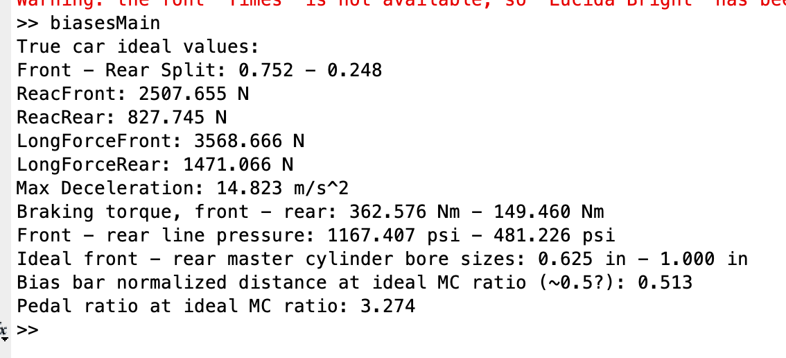

# FSAE Brake Optimization
 MIT Formula SAE brake optimization script

 ## Purpose

 The script takes a Matlab struct of car parameters, which are defined by the various engineering subteams, and calculates the optimal brake ratio and parameters to go into the design process. I wrote this script as part of my work on the Model Year 2022 Car, where I'm responsible for the specification, design, and analysis of the entire brake subsystem.

 ## Sample Output

 Current output using MY21 parameters:

 
